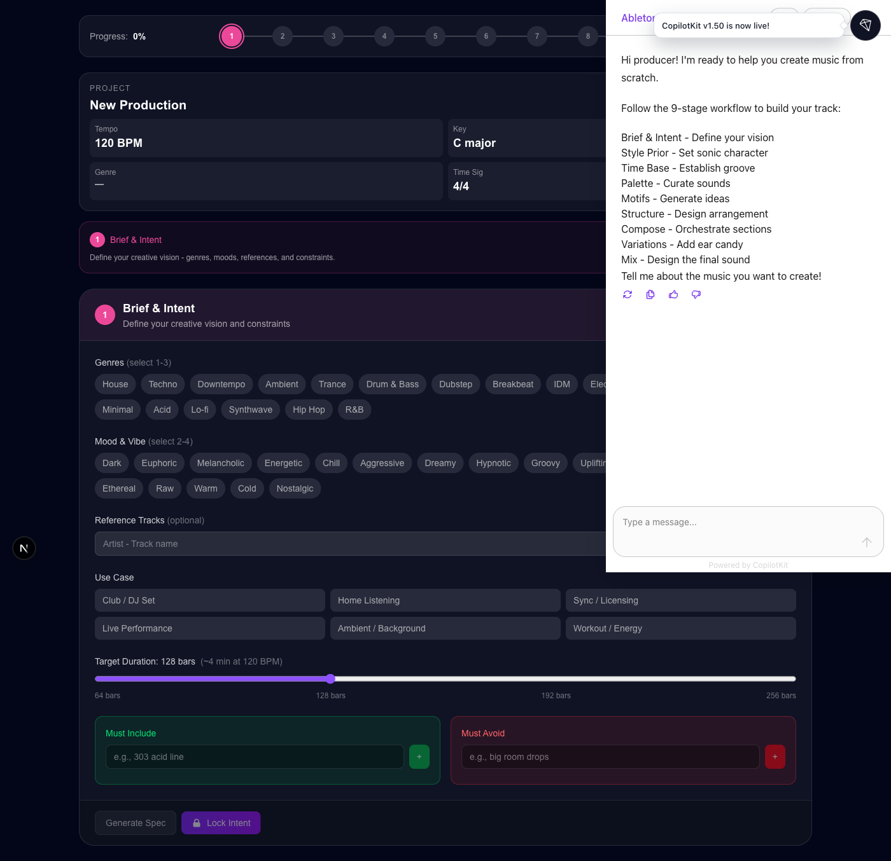
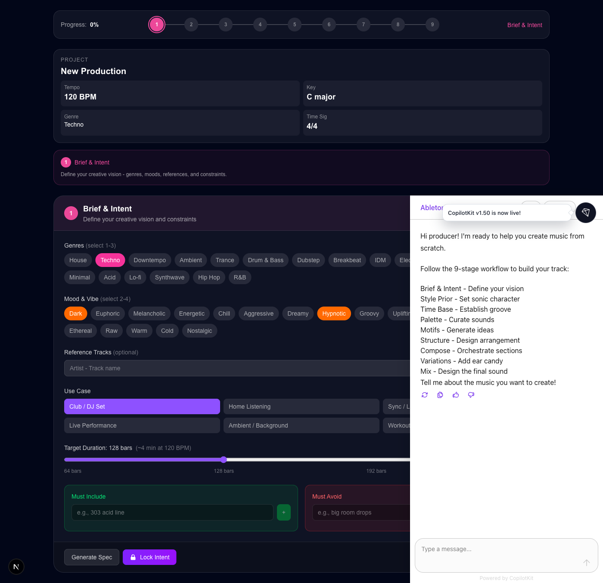
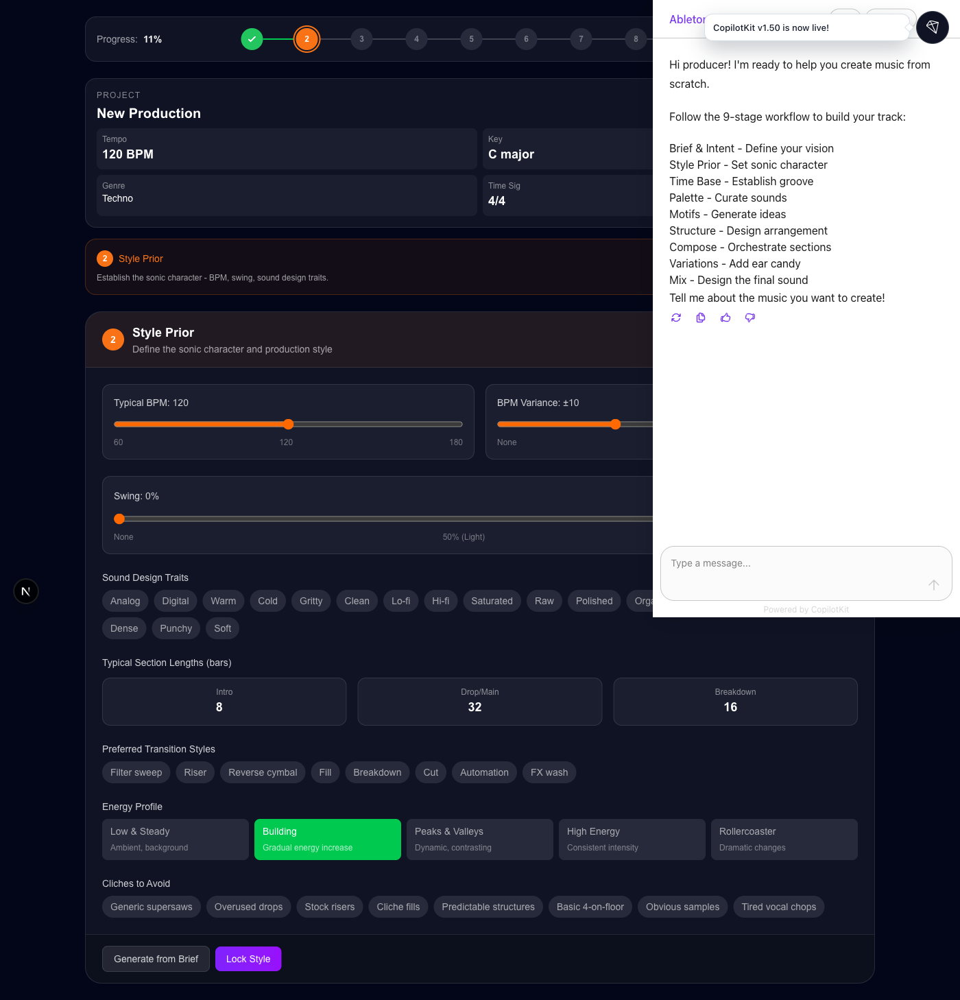
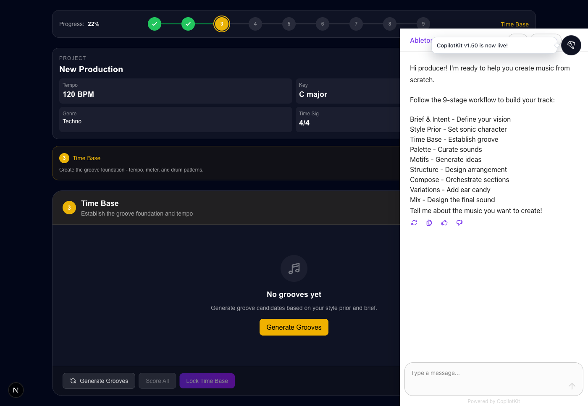

# Ableton Vibes

An AI-powered music production assistant for Ableton Live 12 + Max 9. Create complete tracks from scratch using a guided 9-stage workflow powered by LangGraph and CopilotKit.



## Features

- **9-Stage Production Workflow**: Guided process from initial concept to final mix
- **AI-Powered Assistance**: Chat with the copilot to generate grooves, motifs, structures, and more
- **Real-Time Ableton Integration**: Control Ableton Live directly through natural language
- **Visual Feedback**: See your track take shape with piano rolls, groove grids, and arrangement timelines
- **Sample Search**: Find and insert audio samples from your library

## Prerequisites

- Node.js 18+ or [Bun](https://bun.sh/)
- Ableton Live 12 with [ableton-js](https://github.com/leolabs/ableton-js) MIDI script installed
- OpenAI API Key

## Quick Start

1. **Install dependencies**
```bash
bun install && cd agent && bun install
```

2. **Configure environment**
```bash
# Create agent/.env
cd agent
echo "OPENAI_API_KEY=your-key-here" > .env
echo "SAMPLE_DIRS=/path/to/your/samples" >> .env  # optional
```

3. **Start development servers**
```bash
bun run dev
```

This starts both the Next.js UI (port 3000) and LangGraph agent (port 8123).

4. **Open Ableton Live** and ensure the ableton-js MIDI script is active.

5. **Open** http://localhost:3000 and start creating!

---

# User Guide

## The 9-Stage Workflow

Ableton Vibes guides you through a professional music production workflow in 9 stages. Each stage builds on the previous, helping you create cohesive, well-structured tracks.

### Stage 1: Brief & Intent



Define your creative vision before writing a single note.

**What you do:**
- Select **1-3 genres** (e.g., Techno, House, Ambient)
- Choose **2-4 mood/vibe tags** (e.g., Dark, Hypnotic, Energetic)
- Add **reference tracks** for sonic direction
- Pick a **use case** (Club, Home Listening, Sync, etc.)
- Set **target duration** (64-256 bars)
- Define **rules**: what must be included and what to avoid

**Tips:**
- Be specific with your mood selections - "Dark + Hypnotic" creates a different track than "Dark + Aggressive"
- Reference tracks help the AI understand your sonic goals
- Use the "Must Include" and "Must Avoid" rules to steer creative decisions

### Stage 2: Style Prior



Establish the sonic character and production conventions for your track.

**What you do:**
- Set **typical BPM** and variance range
- Configure **swing amount** and subdivision (8th or 16th notes)
- Select **sound design traits** (Analog, Digital, Warm, Gritty, etc.)
- Define **section lengths** for intro, drop, and breakdown
- Choose **transition styles** (Filter sweep, Riser, Cut, etc.)
- Pick an **energy profile** (Building, Peaks & Valleys, High Energy)
- Mark **cliches to avoid**

**Tips:**
- Match your BPM to your genre (Techno: 125-140, House: 118-128, D&B: 170-180)
- Adding swing creates a more human, groovy feel
- The energy profile shapes your arrangement arc

### Stage 3: Time Base



Create the rhythmic foundation with groove patterns.

**What you do:**
- Generate groove candidates based on your style prior
- View patterns in the **16-step groove grid** (kick, snare, hat)
- Score candidates for danceability, pocket, and genre fit
- Select and lock your primary groove

**Tips:**
- Generate multiple candidates and compare scores
- The groove grid shows where hits land on the 16th-note grid
- Swing percentage affects the feel - start subtle (20-40%)

### Stage 4: Sound Palette

Curate sounds across the frequency spectrum.

**What you do:**
- Build a palette covering Sub, Bass, Low Mid, Mid, High Mid, Presence, and Air
- Add synths, samples, or recorded sounds to each frequency band
- View coverage percentage to ensure a full mix
- Set forbidden sounds to avoid

**Tips:**
- Aim for at least one element per frequency band
- Don't overcrowd - 8-12 total elements is often enough
- Processing hints help inform mix decisions later

### Stage 5: Motif Seeds

Generate memorable musical ideas that form your track's DNA.

**What you do:**
- Generate **melodic, rhythmic, harmonic, and textural** motifs
- View motifs in **mini piano rolls**
- Score for memorability, singability, and novelty
- Select your favorites to develop further

**Tips:**
- Start with 2-3 strong melodic ideas
- Rhythmic motifs work great for percussion hooks
- Harmonic motifs establish chord progressions

### Stage 6: Macro Structure

Design the arrangement architecture.

**What you do:**
- Choose an **archetype** (Build-Drop, Verse-Chorus, ABA, etc.)
- Generate sections with the **arrangement timeline**
- View the **energy curve** overlay
- Mark **key moments** (drops, breakdowns, builds)
- Adjust section lengths and types

**Tips:**
- The energy curve shows intensity over time
- Key moments are where something memorable should happen
- Leave room for builds - tension needs release

### Stage 7: Compose & Orchestrate

Fill each section with voices and harmonies.

**What you do:**
- Select a section to compose
- Generate voices (bass, harmony, lead, pad, rhythm, etc.)
- View notes in **piano rolls per voice**
- Set harmony progressions
- Adjust density levels

**Tips:**
- Start sparse and add layers gradually
- Keep low frequencies mono, spread highs wide
- Each section should have a clear focal point

### Stage 8: Variations & Ear Candy

Add interest and polish with variations and effects.

**What you do:**
- Apply **variation operators** (transpose, invert, augment, simplify)
- Add **ear candy** (risers, impacts, sweeps, vocal chops)
- Enhance transitions with fills and effects
- View all FX on the timeline

**Tips:**
- Don't over-do ear candy - less is often more
- Risers work best 2-4 bars before drops
- Impacts punctuate key moments

### Stage 9: Mix Design

Design levels, spatial positioning, and the master chain.

**What you do:**
- Set **levels and panning** per stem group
- View the **stereo field** visualization
- Configure **reverbs and delays** for depth
- Build the **master chain**
- Set automation keyframes

**Tips:**
- Start with drums at -6dB, build around them
- Wider elements should be less loud
- Leave headroom on the master (-3 to -6dB)

---

## Using the Chat Copilot

The AI copilot assists at every stage. Example prompts:

**Stage 1 - Brief:**
- "I want to make a dark, driving techno track for the club"
- "Set the mood to euphoric and uplifting"

**Stage 3 - Time Base:**
- "Generate 4 groove candidates around 128 BPM"
- "Make the kick pattern more syncopated"

**Stage 5 - Motifs:**
- "Generate a memorable melodic hook in F minor"
- "Create a rhythmic motif based on the kick pattern"

**Stage 6 - Structure:**
- "Build a build-drop structure with 8-bar intro"
- "Add a breakdown at bar 64"

**Stage 9 - Mix:**
- "Generate a mix with wide stereo imaging"
- "Add more depth with reverb on the pads"

---

## Available Scripts

```bash
bun run dev          # Start UI + Agent
bun run dev:studio   # Start with LangGraph Studio
bun run dev:ui       # UI only (port 3000)
bun run dev:agent    # Agent only (port 8123)
bun run build        # Production build
bun run lint         # Run ESLint
```

## Sample Search

The agent can find audio samples from your library:

```bash
# Set sample directories in agent/.env
SAMPLE_DIRS=/Volumes/Samples;~/Music/Samples;~/Downloads
```

Example prompts:
- "Find punchy techno kicks around 128 BPM"
- "Search for atmospheric pad samples in A minor"
- "Insert the first result on a new audio track"

## Architecture

```
ableton-vibes/
├── src/app/                    # Next.js frontend
│   ├── page.tsx               # Main workflow UI
│   └── components/
│       ├── workflow/          # Stepper, StagePanel
│       ├── stages/            # 9 stage panels
│       ├── visualizations/    # GrooveGrid, PianoRoll, etc.
│       └── shared/            # DataCard, ScoreIndicator
├── agent/                     # LangGraph backend
│   └── src/
│       ├── agent.ts          # Main agent graph
│       ├── abletonClient.ts  # Ableton Live integration
│       ├── sampleFinder.ts   # Sample search
│       └── workflow/         # Workflow types & tools
└── docs/screenshots/         # UI screenshots
```

## Troubleshooting

### "Can't connect to Ableton"
1. Ensure Ableton Live is running
2. Check ableton-js MIDI script is installed and active
3. Restart both Ableton and the agent server

### "Agent not responding"
1. Check the agent is running on port 8123
2. Verify your OpenAI API key is set in `agent/.env`
3. Check terminal for error messages

### "No samples found"
1. Verify `SAMPLE_DIRS` paths exist
2. Ensure files are .wav, .aiff, .mp3, .flac, .ogg, or .m4a
3. Check folder permissions

## Documentation

- [CopilotKit Docs](https://docs.copilotkit.ai)
- [LangGraph Docs](https://langchain-ai.github.io/langgraph/)
- [ableton-js Docs](https://github.com/leolabs/ableton-js)

## License

MIT License - see LICENSE file for details.
